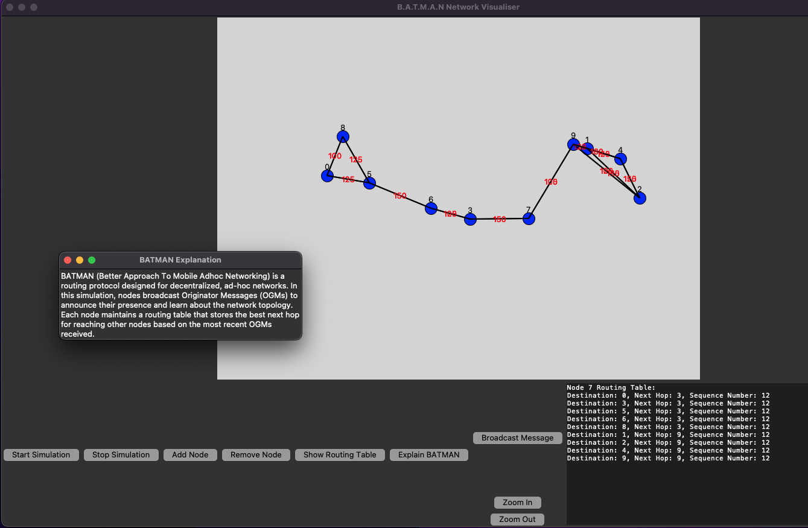

# B.A.T.M.A.N Network Visualiser

## Overview
The B.A.T.M.A.N Network Simulator is a Python application that visualises a network of nodes using the B.A.T.M.A.N (Better Approach To Mobile Ad-hoc Networking) routing protocol. It provides a visual representation of nodes `moving`, `connecting`, and `transferring` data in a simulated network environment.

**Features:**

- Node scattering and movement simulation
- Dynamic connection establishment between nodes
- Visual representation of data transfer with transmission rates
- Zoom-in and zoom-out functionality for better visualization


## Screenshots

<div style="display:flex;">
    
    
</div>


## Getting Started

### Prerequisites:
- Python 3
- Tkinter

### Installation:
1. Clone the repository to your local machine.

   ```bash
   git clone https://github.com/VasanthVanan/batman-network-visualiser.git
   ```

2. Navigate to the project directory.

    ```bash
    cd batman-network-visualiser
    ```

3. Run the application.

    ```bash
    python3 batman-network.py
    ```
    
